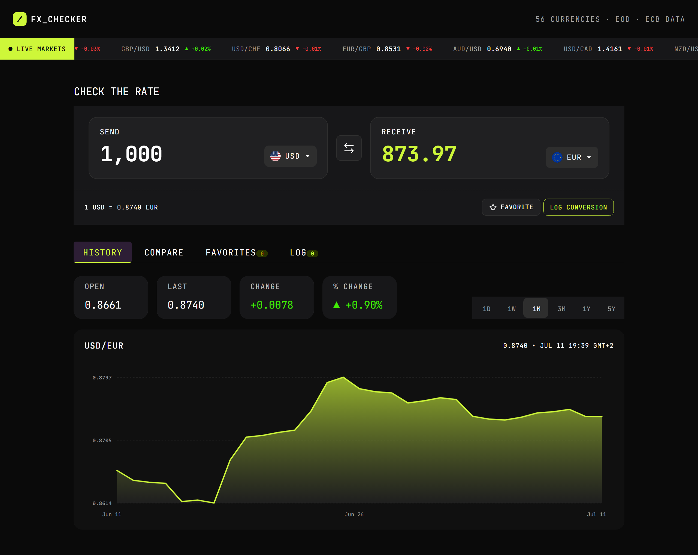

# Frontend Mentor - FX Checker solution

This is a solution to the [FX Checker challenge on Frontend Mentor](https://www.frontendmentor.io/challenges/foreign-exchange-currency-converter). Frontend Mentor challenges help you improve your coding skills by building realistic projects. 

## Table of contents

- [Overview](#overview)
  - [The challenge](#the-challenge)
  - [Screenshot](#screenshot)
  - [Links](#links)
- [My process](#my-process)
  - [Built with](#built-with)
  - [What I learned](#what-i-learned)
  - [Continued development](#continued-development)
  - [Useful resources](#useful-resources)
  - [AI Collaboration](#ai-collaboration)
- [Author](#author)
- [Acknowledgments](#acknowledgments)

## Overview

### The challenge

User actions:

#### Converter

- Live conversion: Calculates and displays exchange amounts dynamically
- Smart currency selector: Features a searchable list to easily choose origin and destination currencies.
- Rate display: Shows market rates for the active pair.
- Currency flipping: Includes a dedicated button to reverse the transaction direction.
- Favorites & Logs: Allows bookmarking preferred pairs and archiving previous conversions.

#### Currency picker

- Smart Currency Search: Browse the complete global currency catalog instantly by code or name.
- Categorized Layout: Streamlined UI grouping currencies into "Popular" and "Other" with high-quality visual flags.
- Instant State Feedback: Checkmark indicator showing the currently active currency.

#### Live markets ticker

- Currency ticker: Displays dynamic currency pairs with exchange rates and 24-hour price trends (positive/negative).

#### Rate history

- **Interactive Historical Charts**: Visual data trends via a combined line and gradient area chart across custom timeframes.
- **Flexible Timeframe Toggles**: Switch chart ranges from intraday (1D) up to long-term macro views (5Y).
- **Comprehensive Market Metrics**: Instant breakdown of latest rate, and net/percentage variations.

#### Compare

- **Simultaneous Multi-Currency Conversion**: Instantly view any input amount converted into a wide range of global currencies at once, each displayed with its live reference rate.
- **Dynamic Favorites Management**: Easily pin or unpin any comparison row to curate a personalized dashboard that synchronizes instantly across your workspace.

#### Favorites

- **Real-Time Favorites Dashboard**: Monitor your bookmarked currency pairs alongside live exchange rates and 24-hour price fluctuations.
<!--- Instant Converter Reload: Quickly load any pinned pair back into the main converter interface simply by clicking its row.-->
- **Effortless Tracking Control**: Easily remove any currency pair from your watchlist with a single click when you no longer need to track it.

#### Conversion log

- **Comprehensive Conversion History**: Access a detailed log of all past conversions, featuring relative timestamps, currency pairs, and precise send/receive amounts.
- **Global History Reset**: Clear the entire conversion log instantly with a single action to start fresh.
- **Granular Entry Removal**: Delete individual history logs selectively to maintain full control over your recorded data.

#### UI & accessibility

- **Fully Responsive UI Layout**: Experience an optimized user interface that adapts seamlessly to any screen size, from mobile devices to large desktops.
- **Polished Interactive States**: View clean hover and focus visual indicators across all buttons, tabs, and interactive elements for enhanced feedback.
- **Keyboard-Only Navigation**: Navigate and operate the entire application smoothly using exclusively the keyboard, ensuring high accessibility (A11y) standards.

### Screenshot

### Links

- Solution URL: [GitHub repository](https://github.com/noemivarela1/foreign-exchange-checker-noemi)
- Live Site URL: [Live demo](https://noemivarela1.github.io/foreign-exchange-checker-noemi/)

## My process

### Built with

- Semantic HTML5 markup
- [Tailwind CSS](https://tailwindcss.com/)
- Mobile-first UI strategy
- Flexbox (Flexible Box Layout) - 1D (one-dimensional) layout model designed to distribute space and align items inside a container
- [React](https://reactjs.org/) -  Open-source, component-based JavaScript library designed specifically for building user interfaces (UIs) 
- [Vite](https://vite.dev/) - Ultra-fast, modern build tool that handles frontend development setup and bundling

### What I learned

Building this project was an incredible learning milestone, as it was my very first time working with React, Vite, and Tailwind CSS. Developing this application from scratch allowed me to elevate my existing knowledge of CSS responsivity and data formatting into a modern component-based architecture. 

Throughout this challenge, I learned state management by implementing the React Context API alongside a dual-storage strategy: using `localStorage` to permanently persist favorites and `sessionStorage` to manage temporary conversion history. It also pushed me to implement defensive coding techniques, handling asynchronous API data safely with conditional guards. Additionally, I enhanced the application's overall user experience by designing synchronized counter badges for desktop, tablet and mobile views, ensuring high accessibility standards and real-time interface feedback.

### Continued development

I plan to continue refining this application by focusing on:
- **Theme Customization**: Implementing a dark/light mode toggle utilizing Tailwind CSS variables.
- **Code Refactoring**: Extracting repetitive API and storage logic into clean, reusable custom React hooks to improve maintainability.

### Useful resources

- [Frankfurter API Documentation](https://frankfurter.dev/) - The official API reference used to fetch reliable, up-to-date currency exchange rates and handle multi-currency conversions dynamically.

### AI Collaboration

### AI Collaboration & Pair Programming

For this challenge, I collaborated with an AI assistant (Gemini) to act as a technical peer and pair programmer. This collaboration was highly beneficial for:

- **Debugging & Problem Solving**: Diagnosing and resolving complex state synchronization issues between custom React Contexts and browser storage APIs.
- **Refactoring & Optimization**: Restructuring repetitive logic and implementing defensive conditional programming to handle asynchronous API loading states without interface failures.
- **Code Review & Quality**: Ensuring high-level Tailwind formatting practices, setting up responsive edge cases for mobile layouts, and refining semantic text formatting for financial data.

This workflow allowed me to maintain absolute ownership of the application's architecture while significantly accelerating my learning curve with React, Vite, and Tailwind CSS.

## Author

- Frontend Mentor - [@noemivarela1](https://www.frontendmentor.io/profile/noemivarela1)
- X - [@noemivarelar](https://x.com/noemivarelar)
